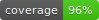

# Test task to Back-End School 2022   

### Technologies used:  
* _Python_
* _Django_
* _Django Rest Framework_
* _PostgreSQL_
* _PyTest_     

## Some commands for comfortable run:  

#### To run tests (pytest)  
1. Activate venv
2. `pip install -r requirements.txt`  
3. `coverage run -m pytest`  
4. `coverage report` or `coverage html` (for generating report in HTML)
5. Remove `coverage-badge.svg` file and run `coverage-badge -o coverage.svg`
&nbsp;   

#### To run application locally (you must have PostgreSQL installed and set up):  
1. Activate venv
2. `pip install -r requirements.txt`
3. Change `DOCKER` field in `config.json` to `false`  
4. `python manage.py makemigrations`  
5. `python manage.py migrate`  
6. `python manage.py runserver localhost:80` (or other port)  

#### To set up remote machine:  
1. Connect to remote machine (via SSH)
2. `sudo git clone <this_repo_url>`  
3. `cd rest-api-test-task`  
4. `sudo python3 -m venv venv`  
5. `source venv/bin/activate`  
6. `sudo pip3 install -r requirements.txt`  
7. [Auto running:](https://winitpro.ru/index.php/2019/10/11/avtozagruzka-servisov-i-skriptov-v-linux/)  
8. `sudo touch /etc/systemd/system/test-script.service` 
9. `sudo chmod 664 /etc/systemd/system/test-script.service`
10. `sudo nano /etc/systemd/system/test-script.service`
11. Write file 
12. Write entry-point SH executor  
13. `sudo systemctl enable test-script.service`
&nbsp;  

### Some demo:  
##### GitHub Actions demo:  

##### Local tests pass results:  
  

&nbsp;  

###### Copyright © 2022