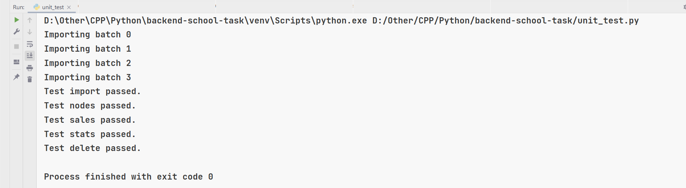

# Test task to Back-End School 2022   

### Used:  
* _[Python](https://www.python.org/)_
* _[Django](https://www.djangoproject.com/)_
* _[Django Rest Framework](https://www.django-rest-framework.org/)_
* _[PostgreSQL](https://www.postgresql.org/)_  
* _[Docker](https://www.docker.com/)_, _[Docker Compose](https://docs.docker.com/compose/)_
* _[PyTest](https://pypi.org/project/pytest/)_ _(with coverage)_     

## _Some commands for comfortable run:_  
### • To test:  
#### To run tests [pytest]:  
1. Activate venv
2. `pip install -r requirements.txt`  
3. `coverage run -m pytest`  
4. `coverage report` or `coverage html` (for generating report in HTML)
5. Remove `coverage-badge.svg` file and run `coverage-badge -o coverage.svg`  

#### To run tests [base tests from task-source]:   
1. `pip install -r requirements.txt` 
2. Run __server in Docker__ (see below how to run in docker) or __in usual way__ (also see below)
3. `python unit_test.py`

### • To launch:
#### To run application locally [no Docker] (you must have PostgreSQL installed and set up):  
1. Activate venv
2. `pip install -r requirements.txt`
3. Change `DOCKER` field in `config.json` to `false`
5. `python manage.py migrate`  
6. `python manage.py runserver 0.0.0.0:80` (or other port, for example 3000)  

#### To run application locally [with Docker] (build & run)
1. `(sudo) docker-compose up -d --build`  
2. `(sudo) docker-compose exec web python manage.py migrate`  
3. [optional] `(sudo) docker-compose exec web python manage.py createsuperuser`
4. `(sudo) docker-compose up` _// to see logs_

### • To deploy:
#### To set up remote machine for running the application:
1. Set `docker` field to `true`/`false` (depending on if you're going to run in Docker)
2. Push changes to GitHub repository `git add <...>`, `git commit -m <...>`, `git push`
3. Connect to remote machine (via SSH) `ssh login@ip`. Following actions are done from remote machine
4. `git clone <this_repo_url>`  
5. `cd rest-api-test-task` 
6. For non-Docker run:
   1. `python3 -m venv venv`  
   2. `source venv/bin/activate`  
   3. `pip3 install -r requirements.txt`  
   4. `python3 manage.py makemigrations`  
   5. `python3 manage.py migrate`
7. For Docker-run:
   1. `docker-compose up -d --build`
   2. `docker-compose exec web python manage.py makemigrations --noinput`  
   3. `docker-compose exec web python manage.py migrate --noinput`  
   4. [optional] `docker-compose exec web python manage.py createsuperuser`
8. [Auto running in container:](https://winitpro.ru/index.php/2019/10/11/avtozagruzka-servisov-i-skriptov-v-linux/)  
9. `sudo touch /etc/systemd/system/test-script.service` 
10. `sudo chmod 664 /etc/systemd/system/test-script.service`
11. `sudo nano /etc/systemd/system/test-script.service`
12. Write file 
13. Write entry-point SH executor  (for running with or without Docker)
14. `sudo systemctl enable test-script.service`
&nbsp;  

### Some demo:  
##### GitHub Actions demo:  

##### Local tests pass results:  
  
##### Docker running on remote Linux machine  

&nbsp;  

###### Copyright © 2022